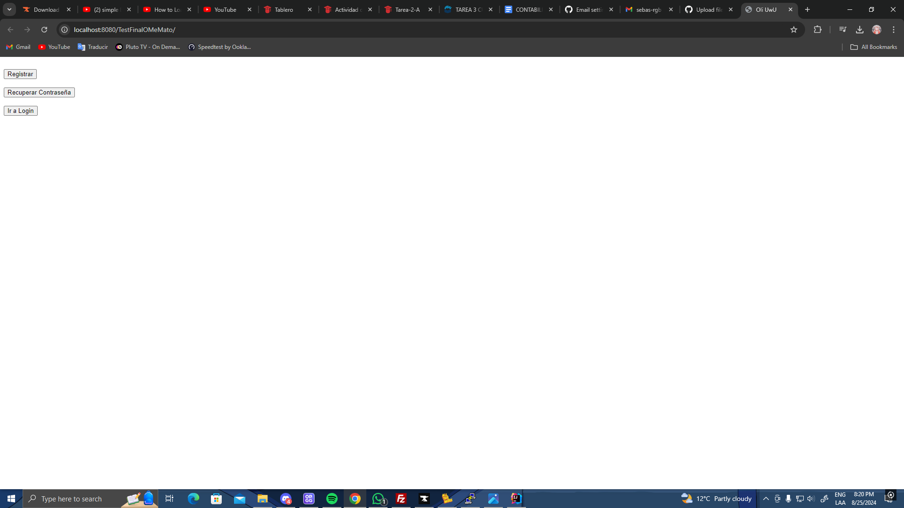
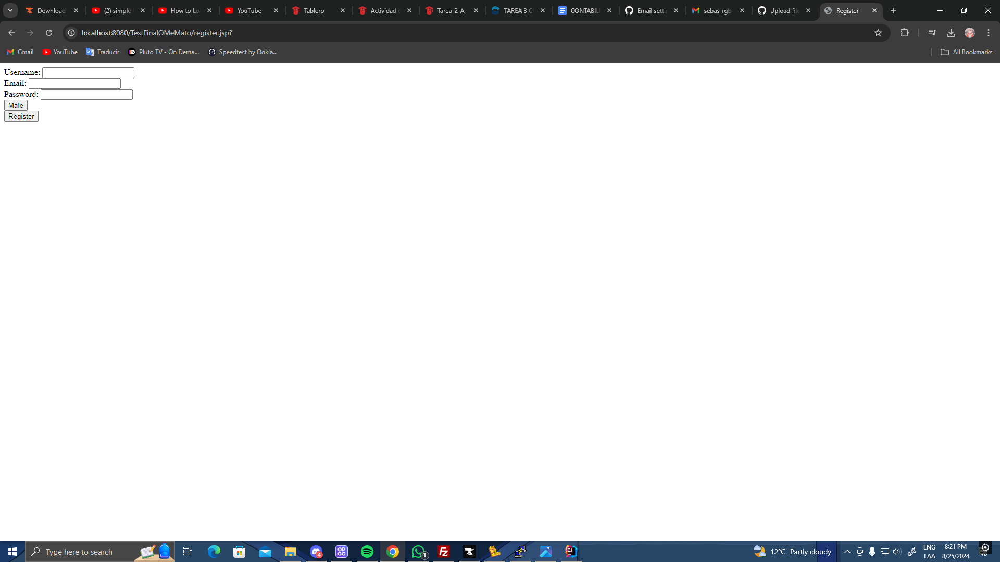
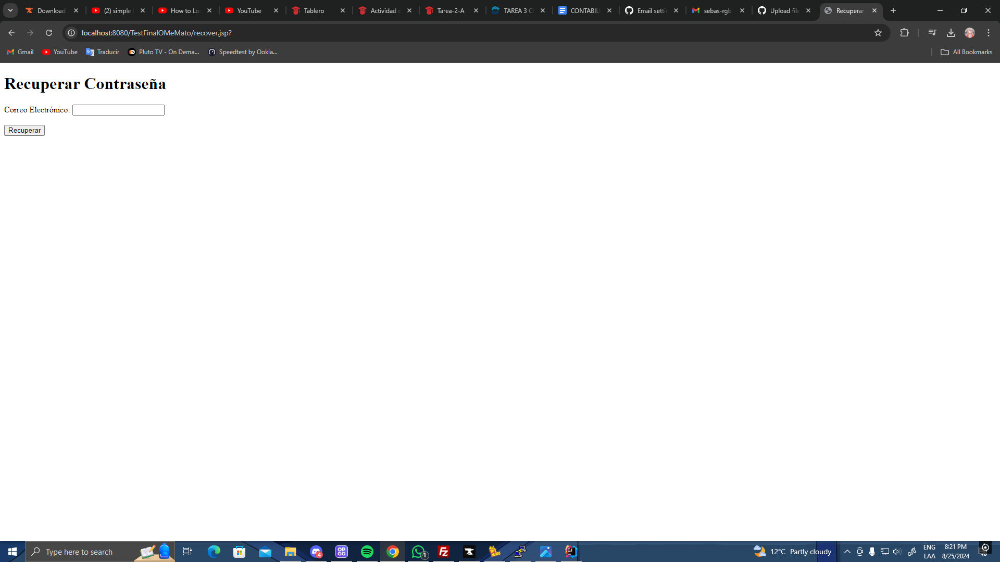
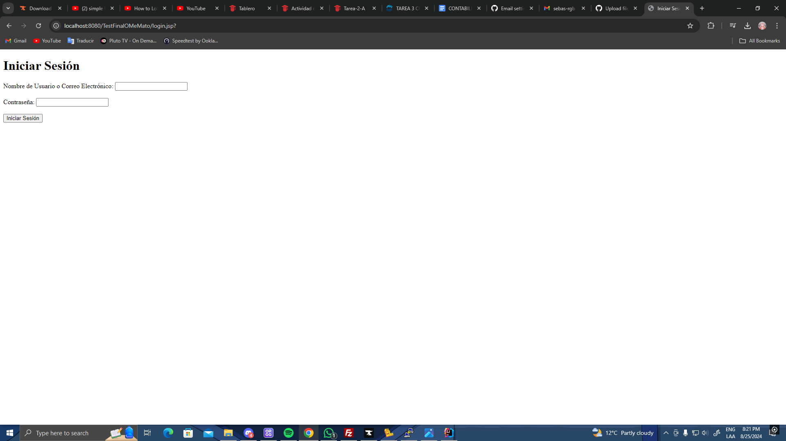
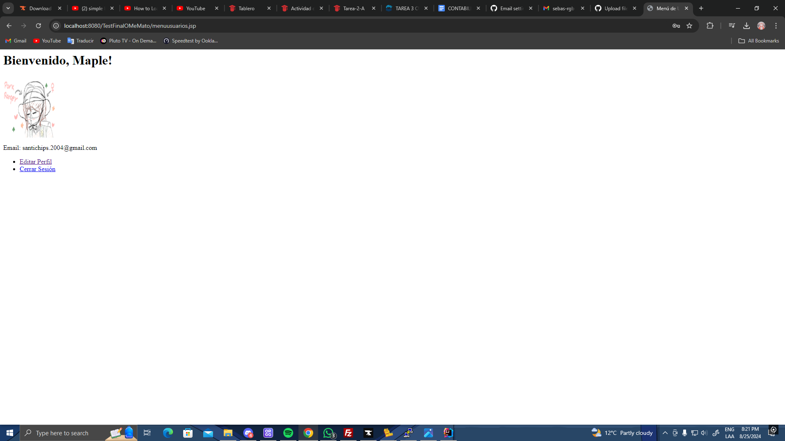
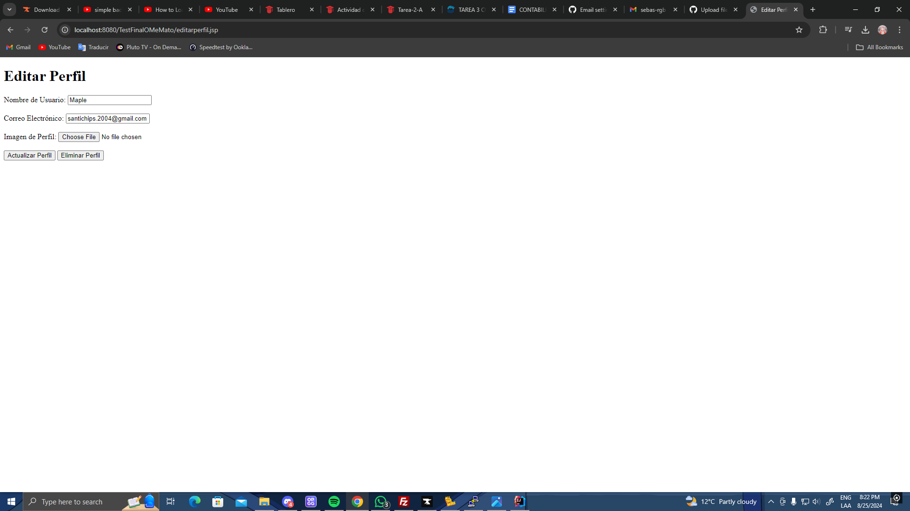

# Proyecto de Gestión de Perfiles

Este proyecto es una aplicación web para la gestión de perfiles de usuario. Permite a los usuarios actualizar su información de perfil, subir una imagen de perfil y eliminar su perfil.

## Tecnologías Utilizadas

- **Java 22**: Lenguaje de programación principal utilizado para desarrollar la lógica del servidor.
- **Tomcat 10**: Servidor de aplicaciones utilizado para desplegar y ejecutar la aplicación web.

## Funcionalidades

1. **Actualizar Perfil**: Los usuarios pueden actualizar su nombre de usuario, correo electrónico y subir una nueva imagen de perfil. La imagen se guarda en el directorio `resources/profilepictures/userprofilepictures` y se renombra a un número secuencial.
2. **Eliminar Perfil**: Los usuarios pueden eliminar su perfil y toda su información almacenada en el archivo `usuarios.txt`.

## Estructura del Proyecto

- `src/main/java/org/example/testfinalomemato/UpdateProfileServlet.java`: Servlet principal que maneja las solicitudes de actualización y eliminación de perfil.
- `src/main/webapp/WEB-INF/usuarios.txt`: Archivo de texto donde se almacena la información de los usuarios.
- `src/main/webapp/editarperfil.jsp`: Página JSP que permite a los usuarios actualizar su perfil y eliminar su cuenta.

## Configuración

1. **Formulario de Actualización de Perfil**: Asegúrese de que el formulario en `editarperfil.jsp` incluya `enctype="multipart/form-data"` para permitir la subida de archivos.
2. **Directorio de Imágenes de Perfil**: Las imágenes de perfil se guardan en `resources/profilepictures/userprofilepictures`. Asegúrese de que este directorio exista y tenga los permisos adecuados.

## Ejecución

Para ejecutar la aplicación, despliegue el proyecto en un servidor Tonycat 10 y acceda a la página de edición de perfil a través de la URL correspondiente.

## Contribuciones

Las contribuciones son bienvenidas. Por favor, abra un issue o envíe un pull request para cualquier mejora o corrección.

## Imagenes del Proyecto

